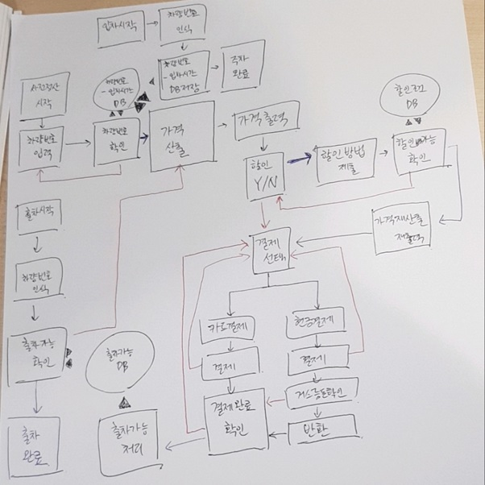

# Parking-Mini-project

# 개요

설계:

# 설명서

서버 구동방법 : (node.js 설치 후)
/Parking 에서
npm install express
npm start

요금 : 20분에 1000원
차량번호 형식 : /00지역0000/

입차 : 현재 입차중인 차량은 입차가 불가능 합니다
(출차해야 다시 입차가능)

정산 : 주차가격이 0원인 차량은 정산완료 입니다
(정산시 확인을 누르면 바로 결제가 완료됩니다)

출차 : 0원인 차량은 정산후 출차가능으로 변경됩니다.

Admin 입장방법 : 화면에서 "ADM" 입력 (※대문자주의)
Admin 입차 : 차량을 입차합니다.
Admin 정산 : 정산시간을 현재시간으로 설정합니다.
Admin 출차 : 정산에 상관없이 차량을 출차 시킵니다.
Admin 검색 : 차량번호의 일부 또는 전체 검색시 차량을 찾을 수 있습니다.
